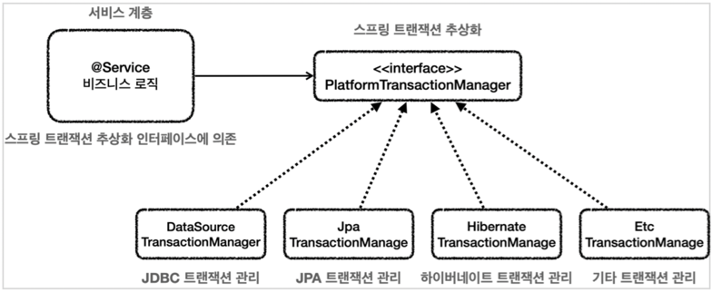
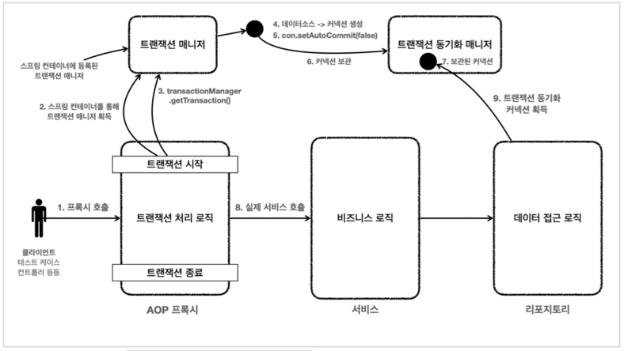

## 스프링 트랜잭션 소개

### 스프링 트랜잭션 추상화
- 스프링은 `PlatformTransactionManager` 라는 인터페이스를 통해 트랜잭션을 추상화한다.
- 
- 스프링은 트랜잭션을 추상화해서 제공할 뿐만 아니라, 실무에서 주로 사용하는 데이터 접근 기술에 대한
트랜잭션 매니저의 구현체도 제공한다. 우리는 필요한 구현체를 스프링 빈으로 등록하고 주입 받아서
사용하기만 하면 된다.
- 여기에 더해서 스프링 부트는 어떤 데이터 접근 기술을 사용하는지를 자동으로 인식해서 적절한 트랜잭션
매니저를 선택해서 스프링 빈으로 등록해주기 때문에 트랜잭션 매니저를 선택하고 등록하는 과정도 생략할
수 있다. 예를 들어서 JdbcTemplate , MyBatis 를 사용하면
`DataSourceTransactionManager(JdbcTransactionManager)` 를 스프링 빈으로 등록하고, JPA 를
사용하면 `JpaTransactionManager` 를 스프링 빈으로 등록해준다.

> 스프링 5.3부터는 JDBC 트랜잭션을 관리할 때 `DataSourceTransactionManager` 를 상속받아서 약간의
기능을 확장한 `JdbcTransactionManager` 를 제공한다. 둘의 기능 차이는 크지 않으므로 같은 것으로
이해하면 된다.

### 스프링 트랜잭션 사용 방식
`PlatformTransactionManager` 를 사용하는 방법은 크게 2가지가 있다.

**선언적 트랜잭션 관리 vs 프로그래밍 방식 트랜잭션 관리**  

- 선언적 트랜잭션 관리(Declarative Transaction Management)
  - `@Transactional` 애노테이션 하나만 선언해서 매우 편리하게 트랜잭션을 적용하는 것을 선언적
  트랜잭션 관리라 한다.
  - 선언적 트랜잭션 관리는 과거 XML 에 설정하기도 했다.
  - 이름 그대로 해당 로직에 트랜잭션을 적용하겠다 라고 어딘가에 선언하기만 하면 트랜잭션이 적용되는
  방식이다.
- 프로그래밍 방식의 트랜잭션 관리(programmatic transaction management)
  - 트랜잭션 매니저 또는 트랜잭션 템플릿 등을 사용해서 트랜잭션 관련 코드를 직접 작성하는 것을
  프로그래밍 방식의 트랜잭션 관리라 한다.
  - 프로그래밍 방식의 트랜잭션 관리를 사용하게 되면, 애플리케이션 코드가 트랜잭션이라는 기술 코드와
  강하게 결합된다.
  - 선언적 트랜잭션 관리가 프로그래밍 방식에 비해서 훨씬 간편하고 실용적이기 때문에 실무에서는 대부분
  선언적 트랜잭션 관리를 사용한다.

### 선언적 트랜잭션과 AOP
- `@Transactional` 을 통한 선언적 트랜잭션 관리 방식을 사용하게 되면 기본적으로 프록시 방식의 AOP 가 적용된다.

- 
- 트랜잭션은 커넥션에 `con.setAutocommit(false)` 를 지정하면서 시작한다.
- 같은 트랜잭션을 유지하려면 같은 데이터베이스 커넥션을 사용해야 한다.
- 이것을 위해 스프링 내부에서는 트랜잭션 동기화 매니저가 사용된다.
- `JdbcTemplate` 을 포함한 대부분의 데이터 접근 기술들은 트랜잭션을 유지하기 위해 내부에서 트랜잭션
- 동기화 매니저를 통해 리소스(커넥션)를 동기화 한다.

### 스프링이 제공하는 트랜잭션 AOP
- 스프링의 트랜잭션은 매우 중요한 기능이고, 전세계 누구나 다 사용하는 기능이다. 스프링은 트랜잭션 AOP
를 처리하기 위한 모든 기능을 제공한다. 스프링 부트를 사용하면 트랜잭션 AOP 를 처리하기 위해 필요한
스프링 빈들도 자동으로 등록해준다.
- 개발자는 트랜잭션 처리가 필요한 곳에 `@Transactional` 애노테이션만 붙여주면 된다. 스프링의
트랜잭션 AOP 는 이 애노테이션을 인식해서 트랜잭션을 처리하는 프록시를 적용해준다.