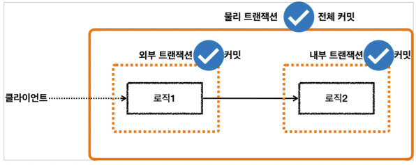

## 스프링 트랜잭션 전파(propagation) - 전파 기본

> 지금부터 설명하는 내용은 트랜잭션 전파의 기본 옵션인 REQUIRED 를 기준으로 설명.

**예제**

### 외부 트랜잭션이 수행중인데, 내부 트랜잭션이 추가로 수행됨

- 
- 외부 트랜잭션이 수행중이고, 아직 끝나지 않았는데, 내부 트랜잭션이 수행된다.
- 외부 트랜잭션이라고 이름 붙인 것은 둘 중 상대적으로 밖에 있기 때문에 외부 트랜잭션이라 한다. 처음
  시작된 트랜잭션으로 이해하면 된다.
- 내부 트랜잭션은 외부에 트랜잭션이 수행되고 있는 도중에 호출되기 때문에 마치 내부에 있는 것 처럼
  보여서 내부 트랜잭션이라 한다.
- 
- 스프링 이 경우 외부 트랜잭션과 내부 트랜잭션을 묶어서 하나의 트랜잭션을 만들어준다. 내부 트랜잭션이
  외부 트랜잭션에 참여하는 것이다. 이것이 기본 동작이고, 옵션을 통해 다른 동작방식도 선택할 수 있다.
  (다른 동작 방식은 뒤에 설명한다.)

### 물리 트랜잭션, 논리 트랜잭션

- 
- 스프링은 이해를 돕기 위해 논리 트랜잭션과 물리 트랜잭션이라는 개념을 나눈다.
- 논리 트랜잭션들은 하나의 물리 트랜잭션으로 묶인다.
- 물리 트랜잭션은 우리가 이해하는 실제 데이터베이스에 적용되는 트랜잭션을 뜻한다. 실제 커넥션을 통해서
  트랜잭션을 시작( `setAutoCommit(false)`) 하고, 실제 커넥션을 통해서 커밋, 롤백하는 단위이다.
- 논리 트랜잭션은 트랜잭션 매니저를 통해 트랜잭션을 사용하는 단위이다.
- 이러한 논리 트랜잭션 개념은 트랜잭션이 진행되는 중에 내부에 추가로 트랜잭션을 사용하는 경우에
  나타난다. 단순히 트랜잭션이 하나인 경우 둘을 구분하지는 않는다. (더 정확히는 `REQUIRED` 전파 옵션을
  사용하는 경우에 나타나고, 이 옵션은 뒤에서 설명한다.)

그럼 왜 이렇게 논리 트랜잭션과 물리 트랜잭션을 나누어 설명하는 것일까?  
트랜잭션이 사용중일 때 또 다른 트랜잭션이 내부에 사용되면 여러가지 복잡한 상황이 발생한다.   
이때 논리 트랜잭션 개념을 도입하면 다음과 같은 단순한 원칙을 만들 수 있다.

### 원칙

- **모든 논리 트랜잭션이 커밋되어야 물리 트랜잭션이 커밋된다.**
- **하나의 논리 트랜잭션이라도 롤백되면 물리 트랜잭션은 롤백된다.**

예제

- 
- 
- 

### 스프링 트랜잭션 전파7 - REQUIRES_NEW

외부 트랜잭션과 내부 트랜잭션을 완전히 분리해서 각각 별도의 물리 트랜잭션을 사용하는 방법이다.
그래서 커밋과 롤백도 각각 별도로 이루어지게 된다.  
이 방법은 내부 트랜잭션에 문제가 발생해서 롤백해도, 외부 트랜잭션에는 영향을 주지 않는다.
반대로 외부 트랜잭션에 문제가 발생해도 내부 트랜잭션에 영향을 주지 않는다.

**REQUIRE_NEW**

- 
- 이렇게 물리 트랜잭션을 분리하려면 내부 트랜잭션을 시작할 때 REQUIRES_NEW 옵션을 사용하면 된다.
- 외부 트랜잭션과 내부 트랜잭션이 각각 별도의 물리 트랜잭션을 가진다.
- 별도의 물리 트랜잭션을 가진다는 뜻은 DB 커넥션을 따로 사용한다는 뜻이다.
- 이 경우 내부 트랜잭션이 롤백되면서 로직 2가 롤백되어도 로직 1에서 저장한 데이터에는 영향을 주지 않는다.
- 최종적으로 로직2는 롤백되고, 로직1은 커밋된다.

**요청 흐름 - REQUIRES_NEW**

- 

요청 흐름 - 외부 트랜잭션

1. txManager.getTransaction() 를 호출해서 외부 트랜잭션을 시작한다.
2. 트랜잭션 매니저는 데이터소스를 통해 커넥션을 생성한다.
3. 생성한 커넥션을 수동 커밋 모드( setAutoCommit(false) )로 설정한다. - 물리 트랜잭션 시작
4. 트랜잭션 매니저는 트랜잭션 동기화 매니저에 커넥션을 보관한다.
5. 트랜잭션 매니저는 트랜잭션을 생성한 결과를 TransactionStatus 에 담아서 반환하는데, 여기에 신규
   트랜잭션의 여부가 담겨 있다. isNewTransaction 를 통해 신규 트랜잭션 여부를 확인할 수 있다.
   트랜잭션을 처음 시작했으므로 신규 트랜잭션이다.( true )
6. 로직1이 사용되고, 커넥션이 필요한 경우 트랜잭션 동기화 매니저를 통해 트랜잭션이 적용된 커넥션을
   획득해서 사용한다.

요청 흐름 - 내부 트랜잭션

7. REQUIRES_NEW 옵션과 함께 txManager.getTransaction() 를 호출해서 내부 트랜잭션을 시작한다.
   트랜잭션 매니저는 REQUIRES_NEW 옵션을 확인하고, 기존 트랜잭션에 참여하는 것이 아니라 새로운 트랜잭션을 시작한다.
8. 트랜잭션 매니저는 데이터소스를 통해 커넥션을 생성한다.
9. 생성한 커넥션을 수동 커밋 모드( setAutoCommit(false) )로 설정한다. - 물리 트랜잭션 시작
10. 트랜잭션 매니저는 트랜잭션 동기화 매니저에 커넥션을 보관한다.
    이때 con1 은 잠시 보류되고, 지금부터는 con2 가 사용된다. (내부 트랜잭션을 완료할 때 까지 con2 가 사용된다.)
11. 트랜잭션 매니저는 신규 트랜잭션의 생성한 결과를 반환한다. isNewTransaction == true
12. 로직2가 사용되고, 커넥션이 필요한 경우 트랜잭션 동기화 매니저에 있는 con2 커넥션을 획득해서 사용한다.

응답 흐름 - 내부 트랜잭션

1. 로직2가 끝나고 트랜잭션 매니저를 통해 내부 트랜잭션을 롤백한다. (로직2에 문제가 있어서 롤백한다고 가정한다.)
2. 트랜잭션 매니저는 롤백 시점에 신규 트랜잭션 여부에 따라 다르게 동작한다. 현재 내부 트랜잭션은 신규 트랜잭션이다. 따라서 실제 롤백을 호출한다.
3. 내부 트랜잭션이 con2 물리 트랜잭션을 롤백한다.
   트랜잭션이 종료되고, con2 는 종료되거나, 커넥션 풀에 반납된다.
   이후에 con1 의 보류가 끝나고, 다시 con1 을 사용한다.

응답 흐름 - 외부 트랜잭션

4. 외부 트랜잭션에 커밋을 요청한다.
5. 외부 트랜잭션은 신규 트랜잭션이기 때문에 물리 트랜잭션을 커밋한다.
6. 이때 rollbackOnly 설정을 체크한다. rollbackOnly 설정이 없으므로 커밋한다.
7. 본인이 만든 con1 커넥션을 통해 물리 트랜잭션을 커밋한다. 트랜잭션이 종료되고, con1 은 종료되거나, 커넥션 풀에 반납된다.

정리
> - REQUIRES_NEW 옵션을 사용하면 물리 트랜잭션이 명확하게 분리된다.
> - REQUIRES_NEW 를 사용하면 데이터베이스 커넥션이 동시에 2개 사용된다는 점을 주의해야 한다

### 스프링 트랜잭션 전파8 - 다양한 전파 옵션

> 스프링은 다양한 트랜잭션 전파 옵션을 제공한다. 전파 옵션에 별도의 설정을 하지 않으면 `REQUIRED` 가 기본으로 사용된다.

1. REQUIRED
    - 가장 많이 사용하는 기본 설정이다. 기존 트랜잭션이 없으면 생성하고, 있으면 참여한다.
    - 트랜잭션이 필수라는 의미로 이해하면 된다. (필수이기 때문에 없으면 만들고, 있으면 참여한다.)
    - 기존 트랜잭션 없음: 새로운 트랜잭션을 생성한다.
    - 기존 트랜잭션 있음: 기존 트랜잭션에 참여한다.

2. REQUIRES_NEW
    - 항상 새로운 트랜잭션을 생성한다.
    - 기존 트랜잭션 없음: 새로운 트랜잭션을 생성한다.
    - 기존 트랜잭션 있음: 새로운 트랜잭션을 생성한다.

3. SUPPORT
    - 트랜잭션을 지원한다는 뜻이다. 기존 트랜잭션이 없으면, 없는대로 진행하고, 있으면 참여한다.
    - 기존 트랜잭션 없음: 트랜잭션 없이 진행한다.
    - 기존 트랜잭션 있음: 기존 트랜잭션에 참여한다.

4. NOT_SUPPORT
    - 트랜잭션을 지원하지 않는다는 의미이다.
    - 기존 트랜잭션 없음: 트랜잭션 없이 진행한다.
    - 기존 트랜잭션 있음: 트랜잭션 없이 진행한다. (기존 트랜잭션은 보류한다)

5. MANDATORY
    - 의무사항이다. 트랜잭션이 반드시 있어야 한다. 기존 트랜잭션이 없으면 예외가 발생한다.
    - 기존 트랜잭션 없음: `IllegalTransactionStateException` 예외 발생
    - 기존 트랜잭션 있음: 기존 트랜잭션에 참여한다.

6. NEVER
    - 트랜잭션을 사용하지 않는다는 의미이다. 기존 트랜잭션이 있으면 예외가 발생한다. 기존 트랜잭션도
    - 허용하지 않는 강한 부정의 의미로 이해하면 된다.
    - 기존 트랜잭션 없음: 트랜잭션 없이 진행한다.
    - 기존 트랜잭션 있음: `IllegalTransactionStateException` 예외 발생

7. NESTED
    - 기존 트랜잭션 없음: 새로운 트랜잭션을 생성한다.
    - 기존 트랜잭션 있음: 중첩 트랜잭션을 만든다.
    - 중첩 트랜잭션은 외부 트랜잭션의 영향을 받지만, 중첩 트랜잭션은 외부에 영향을 주지 않는다.
    - 중첩 트랜잭션이 롤백 되어도 외부 트랜잭션은 커밋할 수 있다.
    - 외부 트랜잭션이 롤백 되면 중첩 트랜잭션도 함께 롤백된다.
    - JDBC savepoint 기능을 사용한다. DB 드라이버에서 해당 기능을 지원하는지 확인이 필요하다. 중첩 트랜잭션은 JPA 에서는 사용할 수 없다.

#### 트랜잭션 전파와 옵션
`isolation` , `timeout` , `readOnly` 는 트랜잭션이 처음 시작될 때만 적용된다. 트랜잭션에 참여하는 경우에는 적용되지 않는다.  
예를 들어서 `REQUIRED` 를 통한 트랜잭션 시작, `REQUIRES_NEW` 를 통한 트랜잭션 시작 시점에만 적용된다.